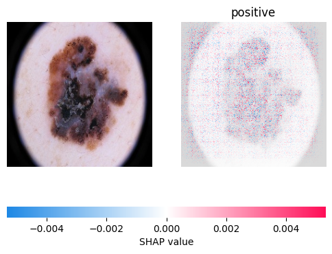

## Use SHAP to interpret models 

To interpret the governing rules for the trained models, we can use SHAP to explain the model's predictions.


(1) Run the following command to install SHAP packages.
``` python
pip install shap
``` 

(2) Import necessary packages.
``` python
import shap
import numpy, os
import matplotlib.pyplot as plt
from os import listdir
from training_func.environment import environment_setup
from training_func.custom_model import load_model 
``` 

(3) Set up the environment and load your model. 

We provide ```environment_setup()``` from "training_func/environment.py" to set up environment, ```load_model()``` from "training_func/custom_model.py" to load model. 

You can import your model from "RDDL_outputs/models/".

``` python
# Set up environment
environment_setup('CUDA', 0)

# load model
model = load_model('RDDL_outputs/models/BB_model_1.h5')
``` 

(4) Prepare the dataset. Load the positive and the negative data from "USER_pos/"" and "USER_neg/" directory.

``` python

EXTENSION = '.jpg'

os.chdir('USER_pos/')
images_pos_data = numpy.array([plt.imread(f) for f in listdir('USER_pos/') if f.endswith(EXTENSION)]
os.chdir('USER_neg/'))
images_neg_data = numpy.array(a[plt.imread(f) for f in listdir('USER_neg/') if f.endswith(EXTENSION)])
all_images = images_pos_data + images_neg_data
``` 

(5) Train a SHAP explanatory model to help interpret the deep learning model.

``` python
# explain the model's predictions using SHAP
explainer = shap.GradientExplainer(model, all_images[1:])
shap_values, indexes = explainer.shap_values(all_images[0]) 

# plot the explanations
shap.image_plot(shap_values, all_images[0], labels = ['positive'], show = False)
plt.savefig('positive.png')
``` 

