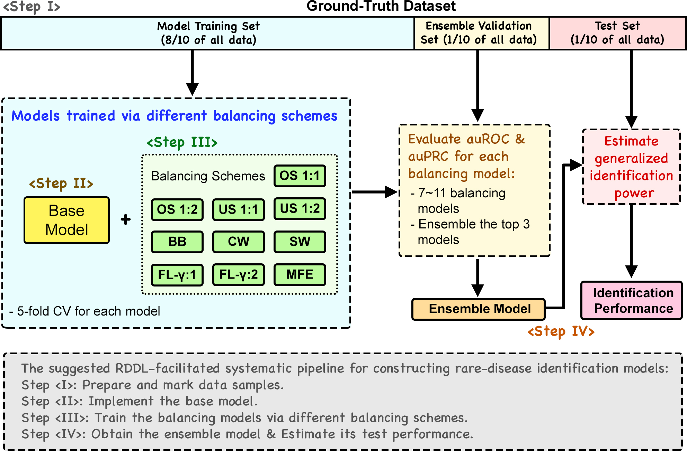
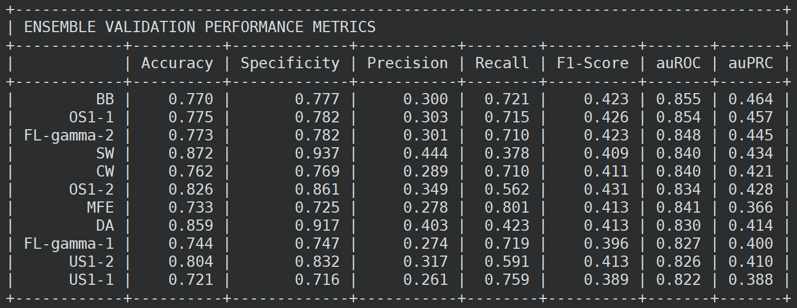
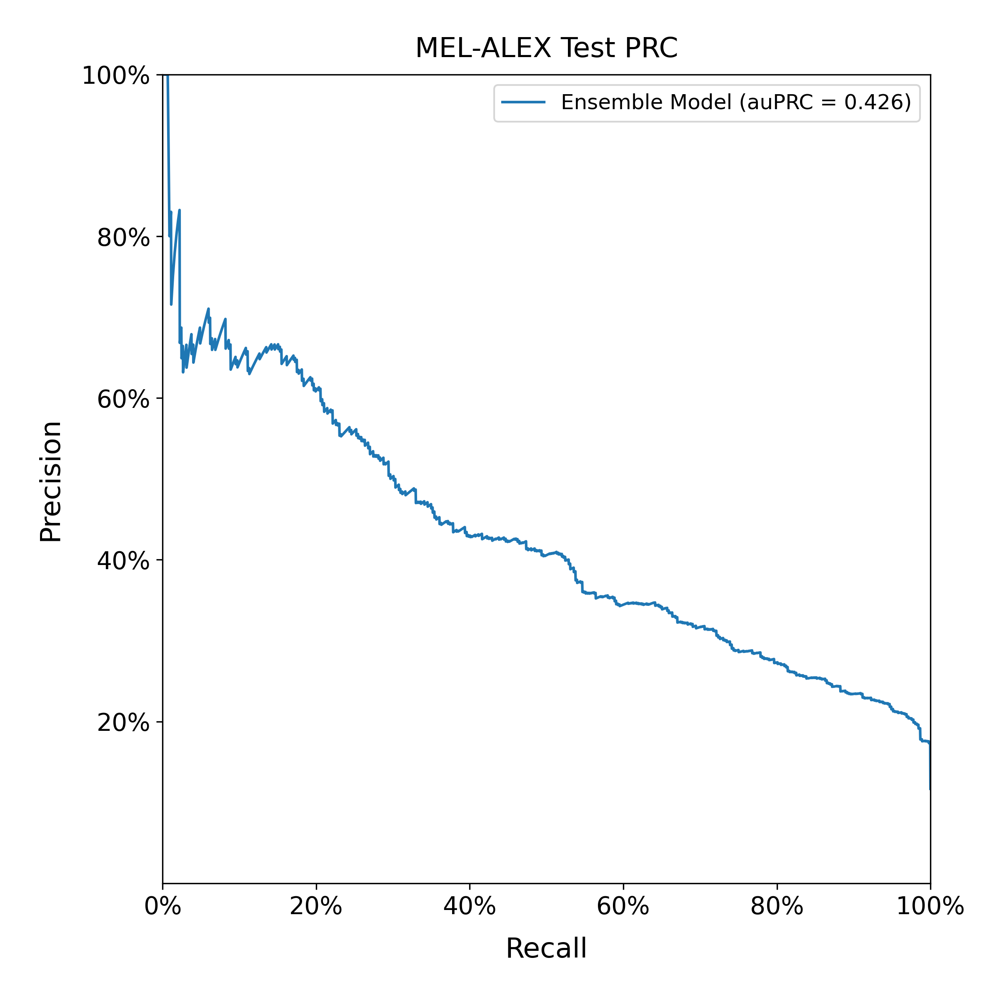

# RDDL (Rare Disease Deep Learning pipeline)

## Related paper: 
Tzu-Hsien Yang*, Zhan-Yi Liao, Yu-Huai Yu, and Min Hsia, "RDDL: a systematic ensemble pipeline tool that streamlines balancing training schemes to reduce the effects of data imbalance in rare-disease-related deep-learning applications". (revised)



## **Prepare the Environment**

Suggested running environments: Linux Ubuntu 16.04.6, Python 3.8.13

We recommend that you can use the conda package to create a new environment. This will automatically install the required python packages. 

Here is an example: 

1. Install the Conda package for you system. The installation of the package can be found <a href="https://docs.conda.io/projects/conda/en/latest/user-guide/install/index.html">here</a>. 

2. Create the RDDL Conda environment. This may take a while, depending on the network status.

```
conda create -n "RDDL" python=3.8.13
```

3. Activate your RDDL Conda environment. 

```
conda activate RDDL
```

4. If you want to leave the RDDL Conda envrionment, please type:

```
conda deactivate RDDL
```

## **Steps to Use RDDL**
1. Download the codes from the following link and unzip the file. Please skip it if you have done this step.

```
wget https://cobis-fs.bme.ncku.edu.tw/RDDL/RDDL.tar.gz
```

2. Unzip the file.

```
tar -zxvf RDDL.tar.gz
```

3. Change the working directory.

```
cd RDDL
```

3. If this is the first time you use RDDL, run the following command to install necessary packages. 

If you intend to use GPU during the model training process, please use the following file to install the packages:

```
pip install -r requirements_gpu.txt
```

Otherwise, 

```
pip install -r requirements.txt
```

 
4. Prepare the samples of diseased data and normal patient data. Users can either provide the sample data as images files or pickle files. The <a href="https://docs.python.org/3.8/library/pickle.html" target = "blank">pickle</a> files enable users to provide their own collected data formats. 

Users need to make a working directory for their tasks:

```
mkdir <TASK_NAME>
```

And put the diseased samples into the "USER_pos/" directory and the non-diseased samples into the "USER_neg/ directory:

```
cd <TASK_NAME>
mkdir USER_pos USER_neg
```

```
<TASK_NAME>/USER_pos/
           /USER_neg/
```

5. **RDDL Step I**: Generate training, ensemble, test set after preparing the positive and the negative data. 

```
python split_data.py -name <TASK_NAME> [-e <size of ensemble dataset>] [-t <size of test dataset>] [-r <random seed>] [-q]
```

> Required arguments:
> 
>* -name: the folder name of the working directory

> Optional arguments:

>* -e: ```float```. Defaults to 0.1. The ensemble set percentage of the whole dataset

>* -t: ```float```. Defaults to 0.1. The test set percentage of the whole dataset

>* -r: ```int```. Defaults to 10. Same Random seed lead to same results

>* -q: if specify, RDDL will not print processing information on the screen

**Notice**
If you want to use the sample-specific weighting balancing scheme, you need to provide the sample weights in the ```sample_weight.csv``` file. 

The ```sample_weights.csv``` must be saved in the directory path specified by -p and -n. Each row should contain the sample name and its weight. These weights will be automatically set to 1 if the file is not provided.

Example formats:


5. RDDL Step II: Write your deep neural network model in the ```USER_model.py``` file. Users must **strictly** obey the following rules:

> Rules:
>
>(1) The input tensor should match the dimensions provided in the input folders. 
>
>(2) The final output tensor must be 2.
>
>(3) Dropout rate are needed to prevent overfitting.

6. RDDL Step III: Train the models with intended balancing methods. This command can be issued by provied the hyperparameters (in json format) of the following balancing methods.

We suggest users systemtically run the all following balancing methods to achieve the best ensemble results.

```
python run_train.py -name <TASK_NAME> -m <balancing method> -nor <normalization option> [-g <gpu id>] [-v <verbose mode>]
```

> Required arguments:

>* -name: the folder name of the working directory

>* "-m": 10 balance methods as below. The hyperparameter json files should be named after these following options (e.g. SOS1.json). These files are expected to be put in the ``` Hyperparameters``` folder. 

>>* "OS1-1": Oversample (positive:negative = 1:1) 
>>* "OS1-2": Oversample (positive:negative = 1:2)
>>* "DA": Oversample using data augmentation (only valid for images)
>>* "US1-1": Undersample (positive:negative = 1:1)
>>* "US1-2": Undersample (positive:negative = 1:2)
>>* "FL-gamma-1": Focal loss (gamma = 1)
>>* "FL-gamma-2": Focal loss (gamma = 2)
>>* "MFE": Mean false error
>>* "BB": Balance batch training
>>* "CW": Class weight
>>* "SW": Sample weight

>* -nor: the specified normalization option for this balancing scheme. (0 --> no normalization, 1 --> image normalization, 2 --> z-score normalization)

> Optional arguments:

>* -g: ```int```. Check if the user wants to use CPU or specified GPU to train. (-1 --> CPU, others --> specified GPU, default = 0)
> e.g. specified -g with 0 will select the first GPU to train the models. 

>* -v <int> verbose (0, 1 or 2), default: 1.

Before running the balancing methods, users are required to set the hyperparameters in the json format. These hyperparameter json files should be placed in the ```USER_hyperparameters``` folder:


```
<TASK_NAME>/USER_pos/
           /USER_neg/
           /USER_hyperparameters/ - OS1-1.json 
                                  - OS1-2.json 
                                  - DA.json
                                  - US1-1.json 
                                  - US1-2.json 
                                  - FL-gamma-1.json 
                                  - FL-gamma-2.json 
                                  - MFE.json 
                                  - BB.json 
                                  - CW.json 
                                  - SW.json 
```


The format in a hyperparameter json file:


>* "name": ```str```. Defaults: "RDDL". Name of this deep learning project.
>* "batch_size": ```int```. Default: 64. The number of samples used in a single batch.
>* "dropout_rate": ```float``` (0 ~ 1). The regularization that avoids model overfitting. Default: 0.1. Users need use the ```dropout_rate``` variable when building the dropout layers of their models.
>* "epochs": ```int```. Defaults: 40. An epoch represents a full iteration over the entire training set.
>* "initial_lr": ```float```. The initial learning rate of the learning rate exponential decay stage. Learning rates controls the optimization speed. 
>* "decay_rate": ```float```. The learning decay ratio used in the learning rate exponential decay stage. The learning rate will start exponentially decay after running 1/5 of toal epochs. 
>* "bottom_lr": ```float```. The minimum learning rate used in the training process.
>* "random_seed": ```int```. Users can specifiy the random seed used in the sampling process if they want to repeat the sampling results in the future. Default: a random chosen number. 

The resulting learning curves can be found in the ```RDDL_outputs/learning_curves/``` folder:

```
<TASK_NAME>/USER_pos/
           /USER_neg/
           /USER_hyperparameters/
           /RDDL_outputs/learning_curves/ - SW_learning_curve_f1-score.png
                                          - ...
```

7. RDDL Step IV: Ensemble the top 3 models and estimate the generalized performance of the ensemble model.

```
python run_ensemble.py -name <case name> [-g <gpu id>] [-v <verbose mode>]
```

> Required arguments:

>* "-name": ```str```. Defaults: "RDDL". Name of this deep learning project.

> Optional arguments:

>* -g: ```int```. Check if the user wants to use his/her CPU or the specified GPU to train. (-1 --> CPU, others --> specified GPU, default = 0)

>* -v ```int```. Verbose.

The evaluation results on the validation set and the test restuls on the test set can be found in the ```RDDL_outputs/plots/``` folder.

```
<TASK_NAME>/USER_pos/
           /USER_neg/
           /USER_hyperparameters/
           /RDDL_outputs/learning_curves/
           /RDDL_outputs/plots/ -ensemble_validation_ROC.png
                                -ensemble_validation_PRC.png
                                -test_ROC.png
                                -test_PRC.png
```

8. RDDL Prediction Usage. Users can utilize the obtained final ensemble model for data label prediction. 
 
```
python predict.py -name <TASK NAME> -i <input sample path> -o <output file> -g 0
```

> Required arguments:

>* "-name": ```str```. Defaults: "RDDL". Name of this deep learning project.
>
>* -i ```str``` The folder that contains the input samples used for prediction
>
>* -o ```str``` The file name of the final prediction results

> Optional arguments:

>* -g: ```int```. Check if the user wants to use his/her CPU or the specified GPU to train. (-1 --> CPU, others --> specified GPU, default = 0)

>* -v ```int```. Verbose.

## **Example and Output Results**

The example is demostrated by the Skin lession dataset used in the paper:

1. Download the processed datasets from the following link.

```
wget https://cobis-fs.bme.ncku.edu.tw/RDDL/RDDL_DEMO.tar.gz
```

2. Unzip the file.

```
tar -zxvf RDDL_DEMO.tar.gz
```

3. Generate the task folder and move the prepared data into this forlder. 

```
mkdir MEL-ALEX
cp RDDL_DEMO/USER* MEL-ALEX -rf
```

If we use the example inputs with the example commands in order:

### Step I 

```
python split_data.py -name MEL-ALEX -e 0.1 -r 913 -q
```

Step I sample outputs:

```
MEL-ALEX/RDDL_splitting_info/ - training_1.csv
                              - training_2.csv
                              - training_3.csv
                              - training_4.csv
                              - training_5.csv
                              - ensemble.csv
                              - test.csv
```
> File descriptions:
> 
>* training-{1~5}.csv: the training-validation set.
>* ensemble.csv: the ensemble validation set.
>* test.csv: the reserved test set.

### Step II
We have already implemented the Alexnet as the base model in this example. 

### Step III
We have already chosen the suitable hyperparameters for different balancing methods for this example. 

For example, we can perform the simple oversampling method (OS 1-2) using the following command: 

```
python run_train.py -name MEL-ALEX -m OS1-2 -nor 1
```

_Step III sample outputs:_ The F1 learning curves of the training process will be provided. The ROC and PR curves of the balancing model are also provided. 

Example: The learning curves of the OS(1:2) balancing scheme:


In this example, we have already trained these models for users to test:

```
cp RDDL_DEMO/MEL-ALEX/RDDL_outputs/models/ MEL-ALEX/RDDL_outputs/ -r
```

**YOU HAVE TO TRAIN THE SELECTED BALACNING MODELS IN REAL APPLICATIONS!!!**

### Step IV

```
python run_ensemble.py -name MEL-ALEX
```

The datasets will be generated in the output folder. The results include the following: the ensemble validation results for the 10 balancing models, the final ensemble model, and the test prediction results

Step IV sample outputs: 

(1) The ensemble validation results of the 10 balancing models




(3) The final test evaulation result of the ensemble model:





### Prediction Step
The final ensemble model can be used to predict newly provided input samples using the following command:

```
mv RDDL_DEMO/DEMO_prediction MEL-ALEX/

python predict.py -name MEL-ALEX -i MEL-ALEX/DEMO_prediction -o MEL-ALEX/predict_results.csv
```

In this example we place the samples that are to be predicted in the ```DEMO_prediction``` folder. And the output prediction probabilities will be saved in the ```MEL-ALEX/predict_results.csv``` file. 


